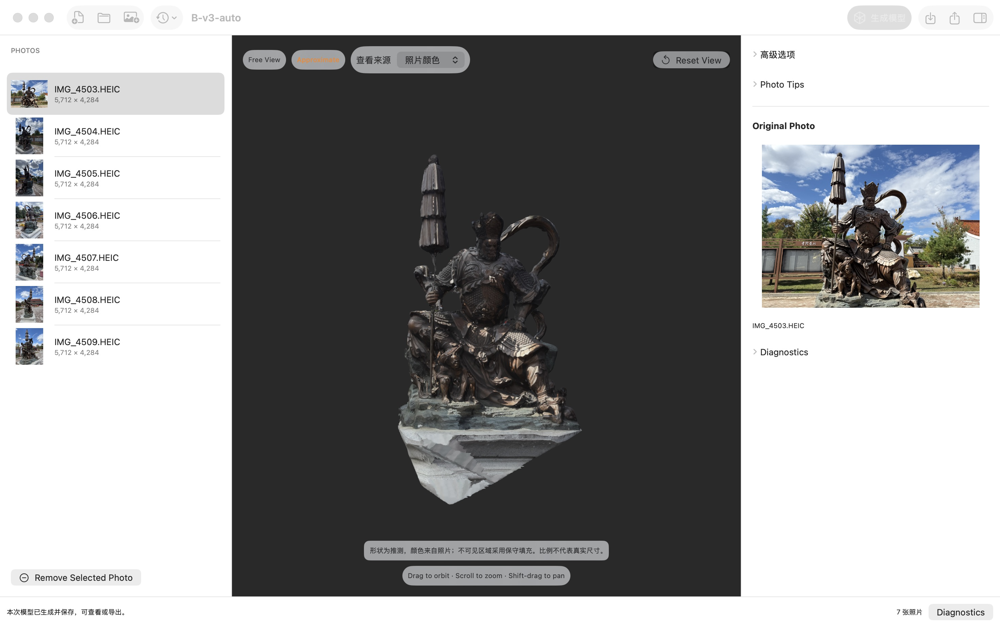
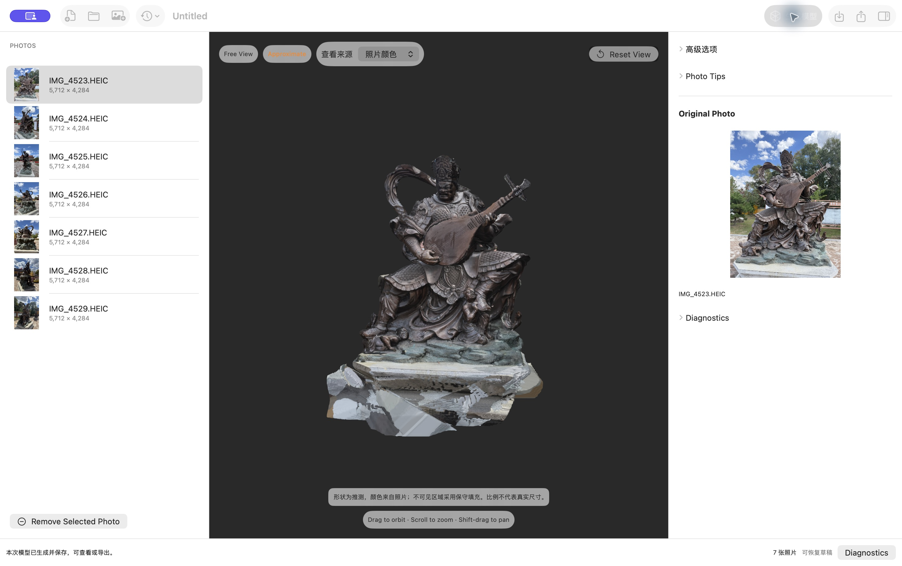
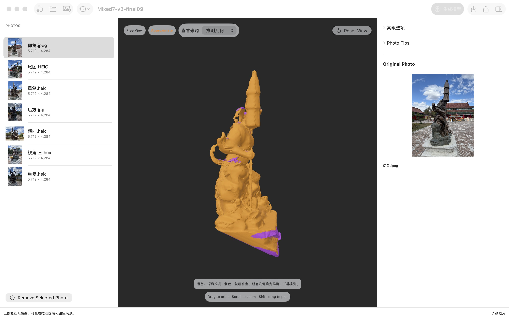
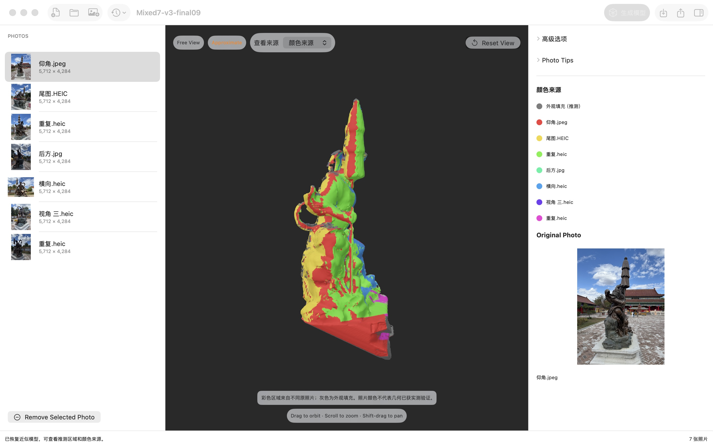

# Rebuild3D

**添加照片，点击生成，得到带真实照片贴图的三维模型。**

Rebuild3D 是原生 macOS 照片建模应用。照片较少时自动尝试近似重建，照片较充分时保留 Apple Object Capture 路线；主体提取、重建、贴图和保存由应用完成。照片和计算留在本机，生成结果可以旋转查看、保存为项目或导出 USDZ。

A native macOS app for local, photo-textured 3D reconstruction — including an automatic sparse-photo workflow with explicit geometry and color provenance.

[v0.1.0 发布](https://github.com/zihaomu/rebuild3d/releases/tag/v0.1.0) · [文档索引](doc/README.md) · [使用说明](doc/v3-本地应用使用与交付说明.md) · [构建指南](doc/开发与构建.md) · [验收记录](doc/v3-一键生成执行与验收记录.md)



*实际应用截图：7 张 iPhone HEIC 照片，一次点击自动生成。伞体、衣甲、飘带和岩石具有三维形状及照片颜色；面部、细杆和底座仍有可见的粗糙与缺失。截图保留实际效果，未做模型修饰。*

## v0.1.0 可以做什么

- **一键生成**：自动准备本地组件、选择重建路线、识别主体、生成网格并铺设照片纹理，无需手工遮罩或选择主照片。
- **看清结果来源**：分别查看推测几何、轮廓补全、照片取色和外观填充。贴上真实照片不意味着形状已经实测验证。
- **可恢复的长任务**：展示当前阶段和已用时间，支持取消与有效阶段复用；生成失败保留原图和上次成功模型。
- **完整项目与导出**：可恢复草稿、稳定照片身份、保存重开、带嵌入贴图的 USDZ；近似结果另附 GLB 和来源记录。
- **照片导入**：按内容识别 HEIC/HEIF、JPEG、PNG 和单图 TIFF，处理方向与精确重复，逐张提示无法读取的文件。

## 获取与使用

**v0.1.0 当前提供源码、文档及真实截图，Mac 二进制安装包已撤下。** GitHub 的 `Source code` 压缩包不是 `.app`；自行构建完整少图版本请参考[构建指南](doc/开发与构建.md)。本地候选包的体积明细、精简机会与验证记录见[安装包说明](doc/macOS-安装说明.md)。

本机验收使用 Apple M5、16 GiB 内存、macOS 26.4.1。项目要求 macOS 26 或更新版本；当前仅验证 Apple Silicon arm64 构建，Intel 和其他机器兼容性尚未验证。

准备好包含组件的应用后：

1. 打开应用，点击 **添加照片**，导入同一物体的一组照片。应用自动建立可恢复草稿。
2. 点击右上角 **生成模型**，等待主体识别、重建和贴图完成。
3. 拖动旋转，滚轮缩放，Shift 拖动平移；点击 **Reset View** 恢复视图。
4. 在 **查看来源** 中检查推测区域和照片颜色来源。
5. 点击 **Save** 保存项目；点击 **Export USDZ** 导出带贴图模型。

生成成功会自动保存到当前项目或草稿。换图后旧模型会明确标为“上次结果，当前照片尚未生成”；取消或失败不会把旧结果当成本次成功。

## 两套七图的实际结果

两套照片分别导入、分别生成，均不依赖手工遮罩、指定贴图照片或旧模型。上图是持伞佛像，下图是另一套 7 张 HEIC 照片的结果。



*衣甲花纹和乐器颜色来自输入照片。底座收口、薄部件和局部接缝仍不理想；自动结果未达到此前手工修订版本的细节质量。*

## 哪些来自照片，哪些属于推测

少图路线的**全部几何和相机位置都是估计结果**。来源视图帮助理解模型是如何形成的，不代表精度认证。

| 推测几何 | 照片颜色来源 |
| --- | --- |
|  |  |
| 橙色为学习深度形成的几何，紫色为轮廓约束补全。 | 彩色区域对应右侧列出的原照片，灰色为保守外观填充。 |

这两张截图来自同一组混合 HEIC/JPEG 输入的同一模型视角。来源记录随项目保存；导出近似模型时，请同时保留同名 `.rebuild3d-result/` 文件夹。

## 已经验证到哪一步

v0.1.0 对应内部 v3 方案的本机 P0 实施成果。核心应用流程及 M0–M5 验收已完成；“v3”是方案迭代名称，不是本次发布版本号。

| 验收项 | 结果 |
| --- | --- |
| 两套用户七图 | 实际应用内一键生成、照片贴图、来源查看、保存重开与移位导出通过 |
| 常规重建 | 33 张 JPEG、59 张 HEIC 两套数据生成与导出通过，并与旧成功基线对照 |
| 额外对象 | 冻结实现后，12 张公开头骨照片首次生成；未使用该对象调参 |
| 混合输入 | 方向变化、重命名、中文与空格路径、同名不同内容、HEIC/JPEG 混合通过 |
| 中断与恢复 | 取消、应用强制退出后恢复、真实磁盘不足及旧结果保护通过；内存失败使用故障注入验证有限重试 |
| 系统睡眠 | UV 展开期间真实睡眠 6 分 28 秒，唤醒后同一任务自动完成并保存 |
| 独立与离线 | 在系统禁止访问网络、仓库和开发工具的环境中生成；缺失组件可从应用包修复 |
| 自动测试 | 40 项 Swift、7 项 Python 通过 |

详细过程、输入来源、构建版本和质量限制见[执行与验收记录](doc/v3-一键生成执行与验收记录.md)。验收使用当前 macOS 账户的系统级隔离，并非另一台机器。完整原图、模型、运行日志和大体积组件保留在本地 `build/`，未包含在源码发布中；README 截图及其[来源清单](doc/assets/readme/screenshots.json)随仓库提供。

## 输入与效果边界

- 至少 3 张照片可以启动；3–12 张走近似路线。更多照片优先尝试常规路线，适用的计算失败可自动转入近似路线。按资源预算缩减输入时，会记录每张照片是否参与计算。
- 核心验收覆盖两套七图，不保证任意 3 张或任意对象都能成功。清晰、重叠充分、覆盖正侧背面、光照稳定的照片更适合重建。
- 面部、细杆、孔洞、遮挡区和未拍到的底部可能粗糙、断裂或被补全；贴图可能保留阴影、接缝和视角差异。比例不代表真实尺寸，不适合直接当作精密扫描。
- 本机验收中两套七图的完整工作进程约 4 分钟和 12 分钟，12 图额外对象约 30 分钟。组件准备另计，时间随内容、机器负载和任务变化，不是性能承诺。
- 应用退出后不承诺继续计算。少图任务再次生成时复用有效阶段，未完成阶段重做；Object Capture 中断后需要重新计算。
- 当前为本地 ad-hoc 签名构建，未完成 Developer ID 签名、公证和跨机器分发验收。

## 开发

需要 macOS 26 SDK 和 Swift 6 工具链。先构建原生目标并运行测试：

```sh
git clone https://github.com/zihaomu/rebuild3d.git
cd rebuild3d
git checkout v0.1.0
swift build
./scripts/test.sh
```

完整少图应用还需要固定版本的 CPython、依赖、VGGT 代码与权重，以及预编译辅助进程。配置、打包和运行时测试命令见[开发与构建](doc/开发与构建.md)。普通用户运行完整应用时无需安装这些开发工具。

```text
Sources/                 SwiftUI 界面、项目存储、生成调度及原生照片准备
Runtime/                 通用少图工作进程、几何融合、UV、贴图及测试
Tests/                   Swift 核心与运行组件测试
scripts/v3/              完整应用打包、组件校验和验收工具
doc/                     方案、阶段目标、验收记录和应用截图
Vendor/                  保留的上游代码及来源说明
```

## 致谢

Rebuild3D 的开发建立在以下项目的工作之上。感谢原作者、维护者和社区贡献者分享代码、模型与工具。

| 项目 | 在 Rebuild3D 中的用途 |
| --- | --- |
| [ekarad1um / Photogrammetry](https://github.com/ekarad1um/Photogrammetry) | 本项目的上游基础。重建服务与 RealityKit 模型查看器基于其会话管理和预览架构改造；原始源码及许可保留在 `Vendor/Photogrammetry/`，固定版本与衍生关系见 [来源记录](Vendor/UPSTREAM.md)。 |
| [Meta / VGGT](https://github.com/facebookresearch/vggt) | 少图重建流程中的相机参数与深度预测，为后续几何融合、照片投影和贴图提供输入。 |
| [Jonathan Young / xatlas](https://github.com/jpcy/xatlas) 与 [Markus Worchel / xatlas-python](https://github.com/mworchel/xatlas-python) | 通过 Python 绑定完成网格 UV 展开与图集排布，供主体照片贴图烘焙使用。 |
| [PyTorch](https://github.com/pytorch/pytorch) 与 [Hugging Face / safetensors](https://github.com/huggingface/safetensors) | 模型权重加载、本地张量计算及 Apple Silicon 上的 MPS 推理。 |
| [trimesh](https://github.com/mikedh/trimesh) | 网格处理、材质组织与带贴图 GLB 导出。 |
| [OpenUSD](https://github.com/PixarAnimationStudios/OpenUSD) | 通过 `usd-core` 创建 USD 场景、网格和材质，并打包 USDZ。 |
| [NumPy](https://github.com/numpy/numpy)、[SciPy](https://github.com/scipy/scipy) 与 [scikit-image](https://github.com/scikit-image/scikit-image) | 几何与图像数组计算、空间查询、插值及 Marching Cubes 表面提取。 |
| [OpenCV Python](https://github.com/opencv/opencv-python) 与 [Pillow](https://github.com/python-pillow/Pillow) | 图像读写、前景掩膜处理和贴图生成所需的图像操作。 |

也感谢 alansartlog 提供的 [Skull Turntable — Strong Lights — White Background](https://gitlab.com/photogrammetry-test-sets/skull-turntable-strong-lights-white-background) 照片集，用于额外对象的重建测试；按其 CC BY 4.0 声明保留来源。

以上列出主要上游与直接依赖，Python 依赖的固定版本见 [依赖锁定文件](scripts/texture/requirements-macos.lock)。应用还使用 Apple 的 Object Capture、RealityKit 与 Vision 系统框架。

## 许可

Rebuild3D 仓库采用 [Apache-2.0](LICENSE)。基于 Photogrammetry 的部分保留其 [MIT 许可及版权声明](Vendor/Photogrammetry/LICENSE)；xatlas 与 Python 绑定分别保留 [xatlas MIT 许可](scripts/texture/xatlas-LICENSE.txt)和 [xatlas-python MIT 许可](scripts/texture/xatlas-python-LICENSE.txt)。

VGGT 固定代码版本的 [VGGT License](https://github.com/facebookresearch/vggt/blob/a288dd0f14786c93483e45524328726ab7b1b4ce/LICENSE.txt)与 [VGGT-1B 权重模型卡](https://huggingface.co/facebook/VGGT-1B/blob/860abec7937da0a4c03c41d3c269c366e82abdf9/README.md)分别适用；权重标注 **CC BY-NC 4.0**，不能将仓库的 Apache-2.0 许可理解为对这些权重的商业授权。

其他运行组件保留各自的许可文件，详见[本地应用使用与交付说明](doc/v3-本地应用使用与交付说明.md)。
