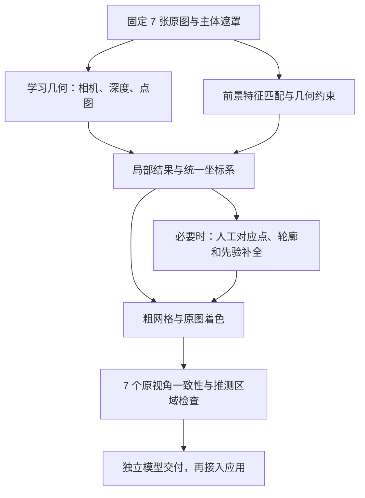

# GOAL：仅用 7 张照片重建中央佛像

> 日期：2026-10-08
>
> 状态：M0–M3 研究阶段已完成，已取得固定 7 张照片的粗网格、来源分区、7 视角对照和复现结果。M4 已实现研究结果接入并通过真实文件/RealityKit 验证；原生应用窗口交互验收尚待完成。整个 goal 保持未完成。
>
> 探索前基线：[`v0.2.0-sparse-baseline`](https://github.com/zihaomu/rebuild3d/tree/v0.2.0-sparse-baseline)，提交 `0cc19af396f46048fd34bdc20b3cc9a0d6c4da44`。代码、诊断脚本及既有记录已推送；标签不表示 P0 验收通过。

## 1. 目标与用户决定

**仅使用现有 7 张 HEIC 作为该对象的照片输入，得到中央佛像可旋转、可保存、可导出的三维结果。允许低精度、缺面、局部失真及近似补全；不能以 Apple 引擎对齐失败或要求补拍作为探索终点。**

用户已明确接受：**照片无法确定的部分允许用先验近似补全，但必须标明推测区域，并保持与原照片一致。**

最初交付为 goal 文档和远端基线；现已开始执行并取得实际三维产物。验收以模型及原图对照为准，不以列出算法、得到错误解释或生成一张效果图视为完成。

这是对既有 v2 的范围调整：原文“补拍后继续”的下一步在本探索中被替换；原先不优先考虑的先验补全，现在可以作为明确标注的降级路线。既有实测事实、原图保护和项目持久化要求继续有效。有限照片的相机估计属于本探索必要工作，不受“完整 P1 对比界面在 P0 后开发”的顺序阻挡。

### 目标对象

中央佛像本体、手持器物及直接相连的雕塑/岩石底座。方形台基单独分组，可保留用于支撑；寺庙、天空、树木、地面、行人和旁边其他造像不进入最终主体。第一轮先用 7 张前景遮罩固定这一边界。

### “有结果”的含义

- 首个里程碑允许是带颜色的局部点云或有深度的局部表面，先证明照片信息可以形成可查看空间结构。
- 研究阶段最终必须交付可辨认该佛像、具有真实三维厚度的网格；允许明显粗糙和缺损，但纯平面贴图、7 张照片组成的广告牌、空网格或任意球体/盒子不算完成。
- 信息不足时，应保留最佳局部结果并进入近似路线，不能因全局精细重建失败就丢弃全部有效结果。
- “不能没有效果”是这组固定输入的工程目标，不承诺任意 7 张无关联照片都可以恢复真实几何。未达到上述最低标准时，goal 保持未完成，不能用无意义模型充数。

## 2. 固定输入与已有证据

本机目录：`/Users/zmu/work/my_project/rebuild3d_workspace/data/`，亦即仓库外的 `../data/`。7 张均为 iPhone 16 Pro HEIC，5712×4284、EXIF 方向 6、Display P3。输入清单如下；原图不提交到 Git，也不上传到在线演示服务。

| 文件 | SHA-256 |
| --- | --- |
| IMG_4523.HEIC | `6c5e09bca0ba9285020a224288d7035e11335c8da5a5f8aa4cb355ce998bd2be` |
| IMG_4524.HEIC | `f3b95cc32b34a27a939e7fbb428cd036112e105a34c03de9a52103b3e2bdb17f` |
| IMG_4525.HEIC | `1029c35d3f66ea1f1ae99a48701e9fd0357ce5db321965867ff560090b7a3649` |
| IMG_4526.HEIC | `798edd3f45a8d1142a59b6254f859dddc1e53558c61d9f76ff3e03df438137d5` |
| IMG_4527.HEIC | `3ac89c78d6afed0b1e14494755821758d17f55431c25b067088f05919b3bc5ed` |
| IMG_4528.HEIC | `9e43a26bd714b24156e752904ea26040cdfa17640fcb23e652dd73dc0fcd5c15` |
| IMG_4529.HEIC | `59b027187238f3f67666385e81882e7cd31204b9cb4d12c39515e6918512fdb8` |

既有 [失败定位报告](iPhone16Pro-HEIC-失败定位-2026-10-08.md) 已确认：

1. 原图能导入、解码、预览、保存，失败发生在 `imageAlignment`。
2. 原始文件夹、样本序列、移除深度、PNG/JPEG 转换、降分辨率，以及背景隔离开/关的 high 灵敏度，共 8 项对照均未取得模型和成功位姿结果。
3. 同机 33 张 TMO JPEG 对照成功，不能将本次失败归结为引擎整体不可用。
4. 独立匹配图提示主体共同特征弱、背景匹配较多；这是主要问题线索，而非“其他算法也一定不行”的证明。

允许解码、裁剪、遮罩、曝光归一化及多尺度工作副本；这些副本仍只有 7 个真实观测。通用预训练模型可以提供先验，但不能引入该佛像的额外照片或现成模型充当实测结果。合成视角如用于后期实验，须标明为派生数据，不能计入真实视角数量或验证集。

## 3. 总体路线：先有粗结果，再提高一致性

不将 Apple Object Capture 作为唯一后端。先固定主体和像素坐标，再以学习几何路线争取第一份点云/表面；前景匹配作为可解释的几何约束；必要时用人工约束和轮廓形成可标注的粗壳体。



图中的两类几何信息可以按资源条件顺序运行，不要求多进程或多代理并行。路线优先级和退出条件如下。

| 路线 | 做什么 | 有效产物 | 何时切换 |
| --- | --- | --- | --- |
| A：前景约束 | 精确主体遮罩；对全部 21 对照片重新匹配；使用可检查的 SfM/联合优化。Apple 只做“精确遮罩”这一新因素的有限对照 | 前景匹配图、可靠局部轨迹、可用相机子集/稀疏点 | 对齐仍不连通时保留局部结果，进入 B/C，不重复既有格式和灵敏度组合 |
| B：学习几何，主要候选 | 优先验证 VGGT 类相机/深度/点图估计，用 7 张原图共同约束；必要时比较 MASt3R 类成对几何和全局对齐 | 相机估计、前景点云、置信度及首个粗表面 | 一轮完整输入与一轮前景处理对照后仍无有效主体，切换候选或进入 C；不无限换阈值 |
| C：显式约束与近似壳体 | 在真实照片上标少量对应点，结合轮廓、粗相机、已有局部深度；联合优化粗体积/表面，再投影原图颜色 | 可旋转的粗佛像、误差图、推测区域分层 | 若轮廓不一致，调整相机和真实约束；不能靠生成细节掩盖整体形状矛盾 |
| D：受限补全 | 只对未被照片确定或已有表面缺损处补全，保持可见部分的轮廓、器物和结构；每次与未补全版本对比 | 单独补全部件与前后对照 | 补全若与任一可见证据明显冲突就回退；不增加无照片依据的显著器物或肢体 |

技术候选已经查阅官方来源；逐项本机验证结果见 [探索记录](七张佛像-探索记录-2026-10-08.md)，未运行的候选不能视为已经验证：

- [COLMAP](https://colmap.github.io/tutorial) 提供可分阶段检查的 SfM/MVS；其 [遮罩机制](https://colmap.github.io/faq.html#mask-image-regions) 可排除背景关键点。它是几何对照和优化工具，不保证稀疏输入成功。
- [LightGlue](https://github.com/cvg/LightGlue) 可作为更强的局部匹配候选；匹配器、特征提取器及权重需分别核对许可。官方区分了 LightGlue/DISK 与 SuperPoint 的许可，不能统一视为同一许可。
- [VGGT](https://github.com/facebookresearch/vggt) 能预测相机、深度和点图，并提供 COLMAP/联合优化出口，适合作为首个学习几何候选。官方区分代码、原始权重与商业用途 checkpoint；执行前固定具体版本和权重，单独记录许可。官方 GPU 示例不构成本机 MPS 性能承诺。
- [MASt3R](https://github.com/naver/mast3r) 作为学习匹配/几何备选，其 [官方许可](https://github.com/naver/mast3r/blob/main/LICENSE) 当前为 CC BY-NC-SA 4.0；先隔离研究，不直接打包进当前 Apache-2.0 应用分发物。

## 4. 实施里程碑

### M0：冻结样本、输出目录和主体范围

- 已完成：基线提交及标签、失败证据、固定文件摘要。
- 已完成首轮：7 张 Vision 前景遮罩、人工岩石底座边界及原图叠加检查；完整保留器物和手臂。遮罩是可修订的研究标注，细边缘仍有误差，不能当作像素真值。
- 保留原分辨率遮罩以及模型输入的裁剪/缩放/方向变换，记录主图索引、工作图尺寸与独立摘要。
- 优先保留完整画布上的前景遮罩。若裁剪/缩放，明确记录像素变换和相机内参变换，不能沿用错误主点；EXIF 方向不能处理两次。

验收：逐张叠加图与输入清单能复查，原始 7 张摘要保持一致。

### M1：尽早得到第一份可查看空间结果

- 在现有 M5 / 16GB Mac 上先探测候选依赖及 CPU/MPS 可用性，再用低分辨率的 2 张输入验证加载、推理和导出，随后扩展到 7 张。
- 首选学习几何的前景点云；若只能得到局部或单视角深度表面，也立即保存并展示，明确它是中间结果。
- 输出旋转预览、点云或局部网格，保留成功部分，不以“尚未完成全部相机对齐”删除产物。
- 单视角深度表面、多个尚未对齐的点云不能冒充最终 7 图重建；M1 通过不等于 goal 完成。

验收：首次实际三维产物能在独立查看器中旋转，中央对象部分可辨；记录使用了哪些原图、哪些部分来自先验。

### M2：让 7 张照片约束同一个对象

- 所有 7 张参与输入、主体轮廓或真实特征约束；不悄悄只用最容易的一张输出“7 图成功”。
- 检查相机顺序、前后关系、镜像、重力、尺度与坐标系。文件名顺序和“平均绕圆一圈”只能用于初值，不能当作真实相机位姿。
- 独立相对深度先处理跨视角尺度/偏移，再融合；保留低置信度和不一致观测的来源。无可靠标尺时只承诺相对尺度。
- 对弱连接视角，允许在真实照片中添加少量人工对应点/轮廓约束，记录人工步骤与耗时。自动、辅助和推测相机分别标记。
- 首先检查头部、躯干、手持器物、底座的相对关系，优先消除多份佛像、镜像、结构重叠和背景粘连。

验收：一份统一对象及 7 个对应查看相机；每张都有原图/渲染/差异对照。暂时无法定位的视角必须明示，不能记为已通过最终验收。

### M3：粗网格、着色与可解释补全

- 根据点云/深度质量选择表面融合或轮廓约束的粗壳体，不以平滑或闭洞默认创造“测量事实”。
- 从可见原图投影颜色；记录遮挡、接缝和曝光差异。纹理拟合好不等于几何正确，必须同时查看无纹理模型。
- 用户允许的补全从缺口和未观测表面开始，单独存储；学习预测的几何也属于推断，不因为带有原图颜色就标成实测。
- 不要求精细面部、衣纹、器物细弦或封闭无孔，但要求主体形状、厚度和关键部位可辨。

验收：粗网格可独立打开，普通着色与来源分区两种预览均可看；保留补全前模型作为对照。

### M4：研究交付及最小应用接入

- 研究交付：GLB 网格、原始点云/深度中间产物、7 视角对照、旋转演示及可复现命令。
- 在选定有效路线后再接入 Rebuild3D，沿用原图身份、输入快照、原子提交、保存重开和取消/失败保护。
- 引擎返回最佳可用结果及其类型；精细重建失败时可显示“局部结果”或“近似重建”，不能把它们写成“精确重建成功”。
- 正常查看保持简单；来源分区视图显示哪些部分是多视角约束、单视角推断或补全。详细方法和置信信息存入项目记录。
- 完成 USDZ 导出与重开，附带来源说明；不能因文件格式不支持某项来源属性就丢掉标记，可使用同名 sidecar 及分区预览。

研究模型通过而应用尚未接入时，只标记研究里程碑完成，不将 P0 或整个 v2 标为完成。

## 5. 推测区域如何标明

来源标记从点/表面一直保留到最终网格，不能只在报告最后加一句“可能不准确”。首版已保守实现“学习推断”和“轮廓补全”两个面组、逐面来源记录及可视模型；并未把预测深度之间的一致性升级为实测。下表保留完整分类方向。

| 分类 | 含义 | 展示与记录 |
| --- | --- | --- |
| 多视角约束 | 有至少两个真实视角的几何/轮廓一致性证据 | 保留支持照片 ID、检查方式及误差；仍不宣称具有测量真值 |
| 单视角/学习推断 | 主要由单幅深度或模型先验得到，缺乏独立多视角几何支持 | 单独颜色，记录方法、权重版本、置信度；不能标成实测深度 |
| 补全 | 闭洞、壳体延伸、对称或生成式先验形成的未确定表面 | 单独部件/面分组，可切换显示；保留补全前结果 |
| 未确定 | 没有足够信息或观测互相冲突 | 保留缺口或低置信标记，不伪造来源 |

由点云生成面时采用保守来源归类；平滑、重采样或闭洞不得自动将推断区升级为多视角约束区。首次来源格式可用 JSON 和面组实现，不必先设计完整产品数据库。

## 6. 验收与比较规则

### 研究阶段必须同时满足

1. 仍是固定 7 张原图；摘要不变，无补拍、无替代对象模型，所有人工或先验步骤有记录。
2. 交付非空、有限坐标、非退化三角面的网格，具有可见三维厚度和中央佛像的可辨形状；主体不由大块背景组成。
3. 可以旋转观察正面、侧面和背面。近似区域允许粗糙，但原图可见的关键部位不能发生明显镜像、复制、位置颠倒或凭空增加。
4. 同一份模型在 7 个原视角下全部有对照图；不能为不同视角分别修改模型来凑出“都像”。估计/人工相机必须明示。
5. 推测、补全与未确定区域可直接查看，并随模型一起交付；不能仅交付普通贴图版本。
6. 从新输出目录按记录命令可复现主要结果，失败后仍保留已有最佳模型。

### 比较指标

记录每视角主体轮廓 IoU、选定真实特征的归一化投影误差、可用相机/约束数、背景残留、几何来源占比、耗时及进程/设备内存。学习预测的置信度不能跨算法直接当同一量纲比较。

没有该对象的真实扫描模型，不能报告真实三维精度。原视角对照是输入一致性检查，不是未见视角准确性证明；相机拟合与纹理贴图可能掩盖错误，因此必须附无纹理旋转图。初轮不设过高画质阈值拒绝有意义的粗结果；先冻结一份基线，再按同一遮罩、关键点与视角比较改善情况。

最终应用验收另加：加载结果、保存、退出重开和 USDZ 导出均可用；旧项目和原图保持完整。

## 7. 实验组织、资源和推进规则

建议新建 `explore/seven-photo-statue` 分支开展算法代码实验；当前标签保持不动。实验数据放在忽略目录，代码、配置和文字结论进入 Git。

```text
build/seven-photo-statue/
  dataset.json                 # 7 张源文件身份及工作副本变换
  masks/                       # 遮罩、人工修订与叠加检查
  experiments/<run-id>/
    config.json                # 算法/权重版本、设备、参数、随机种子
    report.json                # 状态、各视角贡献、指标、资源、限制
    cameras.json
    geometry-provenance.json
    model.glb
    comparisons/               # 7 个原视角 + 无纹理旋转预览
  best/                        # 最佳候选索引，原实验产物不覆盖
```

- 优先本机离线验证；Apple Silicon 的 CPU/MPS 算子、精度和统一内存实际支持逐项确认。不要直接套用 CUDA 示例或把官方 GPU 速度当作本机速度。
- 首轮使用候选模型推荐的低分辨率和小批量，不直接把 7 张 24.5MP 原图送入神经网络。纹理可在粗几何稳定后使用高分辨率原图。
- 同时只运行一个重型重建任务。每次实验设可取消的时间与内存边界，达到边界保存中间产物并切换配置；这些是实验控制，不是成功保证。
- 固定代码提交、权重身份、许可证和依赖清单。代码许可与权重许可分别核对，研究结果有效不自动等于可随应用分发。
- 本 goal 不需要补拍才能推进。若某候选要求当前没有的硬件或权重，记录该候选限制并继续本地可行路线；外部算力、付费服务及照片上传不在当前已确定的执行范围内。
- 允许研究中的人工遮罩和对应点，但应与自动步骤分开计时和说明。先证明结果可得，再决定哪些操作产品化。
- 每轮必须留下模型/点云/遮罩/对照等具体产物或可检验的失败证据。没有新变量和新判断依据，不重跑已经失败的 8 项基线。
- 单条路线失败后保留最佳产物并尝试后续路线。只有满足验收才将 goal 标为完成；不能把“引擎报错”和“建议补拍”写成完成结论。

## 8. 下一轮的具体任务

按以下顺序开始，不先投入完整新界面：

- [x] 推送当前实现和诊断，建立探索前标签。
- [x] 确认允许有标记的先验补全，冻结本 goal。
- [x] 创建探索分支，生成并检查 7 张中央佛像遮罩及工作图坐标变换。
- [x] 核验 VGGT 候选的代码/权重许可与本机推理路径，先做小输入运行检查，再处理全部 7 张。
- [x] 保存首份前景点云或局部表面，提供旋转预览，明确相机/几何推断来源。
- [x] 以 7 个真实视角检查同一对象，补充前景匹配或必要的人工几何约束。
- [x] 形成粗网格和标注补全，完成研究阶段验收；再确定最小应用接入。
- [ ] 完成最终应用的加载、来源切换、保存、退出重开与导出交互验收；核心路径和 RealityKit 加载已通过，原生窗口当前不可读取。

### 可直接用于后续执行的目标指令

> 在 `v0.2.0-sparse-baseline` 所保留的成果上，执行本 goal：仅用 `../data/` 中固定的 7 张 HEIC 重建中央佛像，不把补拍当作前置条件。先完成主体遮罩和学习几何的本机可行性验证，尽早交付可旋转的粗三维产物；Apple 对齐失败时切换可检查的替代路线。允许人工几何约束和先验补全，必须记录其来源并在模型中标出推测区域，用全部 7 张原照片约束和检查同一模型。按里程碑保留最佳结果，持续更新本文件和实验记录，直到研究验收及约定的应用接入完成；不得用平面贴图、空模型或无关模板冒充成功。

## 9. 进度日志

| 日期 | 完成内容 | 实际结果 | 下一步 |
| --- | --- | --- | --- |
| 2026-10-08 | 推送基线并建立 goal；用户确认允许标注的近似补全 | 基线已保全；7 图新路线尚未运行 | M0 主体遮罩与 M1 本机学习几何验证 |
| 2026-10-08 | 建立 `explore/seven-photo-statue`；生成原分辨率/1600 工作图、Vision 遮罩、人工岩石边界及 21 对前景匹配 | 原图摘要不变；前 5 张有候选匹配链，最后 2 张仍弱连接；MPS 可用；权重与实现已固定版本 | 低分辨率 2 图推理，再扩展 7 图并导出可查看产物；详见探索记录 |
| 2026-10-08 | 完成 2 图/7 图、336/518 及前景输入对照，选择完整画面 518；融合网格并完成独立渲染 | 488824 面，66480 面标为轮廓补全；7 视角轮廓 IoU 均值 0.94645；全新目录复现的相机和深度逐项一致 | 研究产物保全，进入 M4 |
| 2026-10-08 | 接入近似研究结果包、格式 3、来源查看和附来源导出；33 项测试及发布构建通过 | 真实模型与来源模型均由 RealityKit 载入；原项目不变、原图 ID 不变、保存重开及完整导出通过；UI 工具对多个原生应用返回窗口不可见 | 等待可见桌面后完成最终应用交互，不将文件级验证冒充 UI 验收 |
