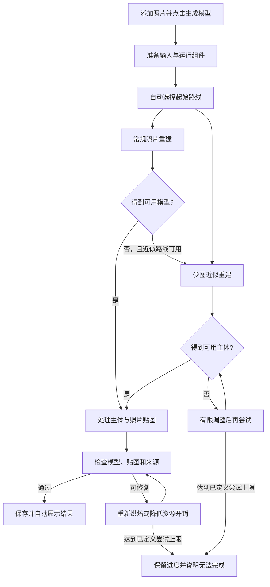

# Rebuild3D v3 方案：添加照片，点击生成

> 日期：2026-10-09
>
> 状态：待实施方案。本轮只编写文档，不代表下述自动化能力已经实现。
>
> 核心目标：用户添加同一物体的照片，点击一次“生成模型”，等待后直接得到可旋转、带照片贴图、可保存和导出的三维模型。
>
> 用户偏好：操作尽量简单，可以接受较长等待；照片有限时可以接受较粗糙的近似结果。推测部分必须明确标记，并与原照片可见内容保持一致。
>
> 版本关系：保留 [v2 原文](Rebuild3D-项目启动文档-v2.md)及前两阶段成果。本版调整产品主流程、重建调度和完成标准；与旧方案冲突时，后续实施以本版为准。

## 1. 第三版要交付什么

**把已有的少图重建和纹理能力变成应用内部可以自动运行的完整功能。**

用户只需要三个动作：

1. 添加照片。
2. 点击“生成模型”。
3. 查看结果，需要时保存或导出。

用户无需选择引擎、运行命令、安装 Python、寻找模型权重、制作遮罩、整理研究目录、导入中间模型，或判断失败后应该改哪个参数。一次生成任务包括必要的输入准备、内部路线切换、近似重建、照片贴图和结果检查。

“一键生成”指一次操作启动完整流程，不代表瞬间完成。应用可以多花时间计算，但必须让用户知道仍在处理什么、可以取消，以及中断后能保留什么。

第三版首先满足当前 Mac 上的本地使用。普通照片不上传，联网仅用于必要组件的下载；已有组件齐全时，生成和查看都可以离线进行。

## 2. 现状与本次问题

截至本版建立，已有能力与缺口如下：

| 项目 | 已完成的事实 | 第三版必须补齐 |
| --- | --- | --- |
| 普通照片与项目 | HEIC/JPEG 等导入、方向处理、去重、草稿、保存重开已有实现 | 所有重建路线复用这些能力，超大照片自动生成合适工作副本 |
| 原生重构按钮 | `Reconstruct` 调用 Apple Object Capture；部分公开照片集已成功 | 按钮调用统一任务服务，由应用决定使用哪条路线 |
| 七图近似重建 | `IMG_4523–4529` 已经由独立研究脚本生成可用佛像 | 支持新照片、新文件名、新目录和变化的照片数量 |
| 第二阶段纹理 | 固定佛像已生成真正 UV 贴图，应用能加载、保存和导出 | 从本次新生成的网格自动完成同样类别的纹理处理 |
| 近似结果接入 | `Load Approximation` 导入外部已生成的结果 | 普通用户不需要看见或操作这个入口 |
| 自动化程度 | 旧成果使用过针对照片的手工遮罩修订和局部选图 | 普通生成路径使用自动处理，人工配置仅保留为历史对照 |
| 失败体验 | 通用错误后要求用户重试；旧模型仍可见 | 内部自动处理可恢复失败，清楚区分旧结果与本次结果 |

2026-10-09 的新图 `IMG_4503–4509` 已正确进入当前按钮流程，两次运行约 3.5 秒和 3.8 秒后失败；界面诊断停在 `imageAlignment`，返回错误 6，输出为 0。这说明新图启动了现有 Object Capture 路线，尚未调用此前的少图近似流程。通用错误本身不能证明这组新照片的唯一失败原因。

前两阶段的成果继续有效，但它们证明的是“固定照片的模型可生成、可交付”。**第三版必须证明“用户在应用里换一组照片，仍能点击生成”。**

## 3. 用户能看到的完整流程

| 时刻 | 界面与行为 | 用户需要做什么 |
| --- | --- | --- |
| 空白窗口 | 一个主要入口“添加照片”，也支持拖放 | 选择或拖入照片 |
| 导入完成 | 缩略图和数量，主要按钮“生成模型” | 点击生成 |
| 首次缺少运行组件 | 自动在同一任务内准备组件，显示下载大小、进度和取消；需要许可确认时一次说明 | 正常情况无需另行操作；必要时完成首次许可确认 |
| 正在生成 | 显示当前阶段、已用时间和“取消” | 等待，或取消 |
| 自动换用近似处理 | 提示“正在根据照片估计物体形状，部分区域会采用近似补全” | 继续等待，无需选择算法 |
| 完成 | 直接展示带贴图模型，支持旋转、缩放；显示简短结果说明 | 查看，按需保存或导出 |
| 中断后再次打开 | 显示“上次生成尚未完成”，可继续已保存的任务 | 点击继续 |

不在每个阶段弹出确认框。首次组件准备属于同一次生成任务，下载完成后继续执行，不再要求重新点击生成。正式项目名称和保存位置不作为启动前置条件，沿用可恢复草稿。

本版先验证三张及以上、同一静止物体的不同视角照片。少于最低可用输入时直接说明还需添加照片；最低数量只是启动条件，不保证覆盖充分。照片模糊或覆盖不足可以提示，但有可用输入时不要求用户完成一套拍摄检查表才允许尝试。

### 3.1 主要按钮与布局

- 主按钮统一命名为“生成模型”，不再让用户区分“重构”和“加载近似结果”。
- 运行时主按钮区域显示状态与“取消”；完成后可“重新生成”，旧结果仍保留。
- 主视窗始终是三维结果；照片列表用于确认输入，原图预览和结果说明放在可展开面板。
- `Load Approximation`、引擎参数和技术日志移入开发/高级入口，不占普通流程主工具栏。
- 原有 Sources 改为用户易理解的“查看推测区域”。默认显示正常照片颜色，结果说明常驻一句“包含近似区域，非实测尺寸”；展开后区分几何推测与外观填充。
- 保存项目、导出模型保留。近似来源记录自动随结果保存和导出，不要求用户自己查找附件。

### 3.2 更换照片后的结果归属

这是本版的必修项：输入改变时，不能继续把旧模型当作新照片的结果展示。

- 立即显示“这是上一次生成的模型，当前照片尚未生成”，并降低旧结果的视觉强调。
- 生成期间可保留旧模型供查看，但明确标注“上次结果”；本次进度与上次模型分开显示。
- 本次成功并完成保存后，才切换为新模型；失败或取消保留旧模型，不冒充本次成功。
- 导出入口明确导出的结果版本；输入已变化时标为“导出上次结果”。
- 每次生成绑定不可变的照片 ID、内容摘要和输入快照，不能只通过窗口标题判断对象是否变化。

## 4. 一次点击后，应用自动做什么

以下为内部流程，用户不需要理解其中的引擎名称。

### 4.1 自动选择路线

首版采用清楚、可测试的规则，不依赖尚未验证的“智能质量评分”：

- **少量照片优先近似路线。** 暂以 3–12 张作为工程分段，使用学习估计相机/深度、主体约束融合和照片贴图；该范围是待验证的调度策略，不是模型已经保证支持的范围。
- **照片较充分时优先 Object Capture。** 保留已经成功的常规照片重建能力；出现对齐或模型生成失败时，在资源和输入支持范围内转入近似路线。
- 后续可以利用可解释的重叠检查调整起始路线；不能仅凭数量宣布某组照片一定成功或一定失败。
- 同一任务中每条路线的尝试都有记录。已失败且输入、参数未变的尝试不再重复，不让用户反复点击同一按钮碰运气。
- Object Capture 已生成合格的带纹理主体时，复用其结果；只有缺少合格照片纹理或需要单独提取主体时，才进入额外烘焙。不能强行依赖尚未打通的相机映射去重贴所有常规结果。

对于多于当前近似后端容量的照片，应用可以自动选择覆盖不同视角的计算子集，其余保留用于纹理和检查。选择必须依据内容和资源预算，不能只取文件列表前七张；须记录每张的用途。分组推理及组间相机统一未验证前，不承诺任意照片数量都能使用近似后备路线。

### 4.2 自动识别主目标

- 默认识别多张照片中反复出现的主要物体，通过跨视图一致性选择主体，而不是每张独立选择最大的物体后直接合并。
- 统一主体定义：默认包含与目标直接相连的器物、衣带、雕塑附件及有合理联系的底座；避免混入天空、建筑和旁边其他对象。
- 使用自动分割、跨视图投影检查和保守边界处理空隙及遮挡；边界不可靠处降低取色可信度并标记填充。
- 不把第二阶段按 `IMG_452x` 记录的多边形、蓝天小框或袖口选图规则当成通用算法。
- 只有多目标且应用确实无法判断时，才允许一次“点选要生成的物体”作为异常恢复；正常单目标及两组七图核心验收不得依赖这一步。
- 人工精修可以后续提供，但不是普通生成成功的前置条件。

### 4.3 自动生成主体贴图

- 几何推理与纹理取样分辨率分开；颜色取自完整方向归一化照片的工作副本。
- 网格自动展开 UV，逐像素检查遮挡、主体 mask 和照片投影，选择连续可靠的主视图。
- 主视图选择改为根据本次照片自动决定，不使用指定照片文件名或固定区域。
- 对未对齐的高频纹样不强行平均；不可靠区域使用低频或中性填充并记录来源，不生成虚构雕纹冒充照片细节。
- 默认以 4K 作为纹理预算目标；资源紧张时可先保存合格的 2K 结果，再继续生成 4K。4K 是文件预算，不是清晰度保证。
- 来源记录与网格、UV、贴图同时生成；照片颜色支持不等同于准确几何。

## 5. 结果标准与无法完成时的处理

### 5.1 可以接受的结果

用户已接受有限照片下的近似。本版允许局部粗糙、未观测区域补全、残余接缝和不准确尺度，但交付必须满足：

1. 是与本次照片对应的同一主体，主要结构能辨认，具有可旋转的三维体积。
2. 包含三角网格、有效 UV、实际照片颜色贴图及可加载材质。
3. 能从多个角度查看，保存后重开，导出后离开项目目录仍带贴图。
4. 推测几何、轮廓补全和外观填充有可查看的记录，且记录随结果保留。
5. 主要目标没有被背景取代，也没有为了通过检查而删除器物或困难部位。

只有文件生成、仅一张照片贴在平面上、空网格、碎片点云、旧模型复用或凭空套用另一座佛像，都不算成功。

### 5.2 内部失败不立即变成用户失败

| 失败情况 | 应用先自动处理 | 最终需要用户处理时 |
| --- | --- | --- |
| 常规照片对齐失败 | 转入可用的近似路线 | 所有适用路线都未产生合格结果时，说明尚未形成可用模型 |
| 推理资源不足 | 释放当前资源，降低推理分辨率或计算批量，复用已完成阶段 | 明确说明本机资源不足，保留可继续的任务 |
| 主体遮罩不稳定 | 跨图修正、保守取色及检查其他候选 | 多目标歧义时允许一次点选；不能反复要求画遮罩 |
| 贴图或打包失败 | 保留几何，重做当前贴图/导出阶段 | 说明模型形状已保存、颜色处理未完成，允许继续；不标记整体完成 |
| 下载中断 | 校验已有片段并支持恢复，输入和任务保留 | 提示网络问题，不让用户安装依赖或手动下载权重 |
| 存储不足 | 停止发布新结果，保留有效阶段及旧结果 | 提示所需空间和继续入口 |
| 照片无法读取或不是同一物体 | 隔离无效输入，不影响其余可用照片 | 明确指出有证据的问题及最少需要用户处理的内容 |

默认内部尝试建议为：常规路线最多一次；近似路线初次运行加一次有明确原因的配置调整；贴图修复最多一次。预算由阶段实验修订并写入任务记录，不能无限循环。达到上限时展示已获得的状态和后续动作，不反复执行同一失败配置。

产品目标是尽力自动生成有依据的近似结果，不是对任何图片组合承诺百分之百成功。不能为了避免失败而制造与照片无关的模型。**两组已指定的七图是必须攻克的版本验收样本，不能用这条边界解释为可跳过。**

## 6. 长任务：允许慢，但不能失去控制

### 6.1 进度与预览

用户看到的阶段使用普通语言：准备照片 → 识别主体 → 生成形状 → 添加照片颜色 → 检查并保存。

- 显示实际阶段和已用时间；有可靠阶段进度才显示百分比，无可靠依据时显示正在处理。
- 剩余时间在建立实测基线后给出范围；初期使用“可能需要较长时间，请保持应用运行”，不承诺固定几分钟完成。
- 切换内部路线时，不把整体进度强制退回 0%，也不先宣布失败再悄悄继续。
- 有可用阶段模型时可以展示“预览，正在完善颜色”，用户无需再次点击增强。最终完成以带贴图资产检查和落盘成功为准。

### 6.2 恢复、取消与资源

- 持久化输入准备、主体 mask、相机/深度、融合网格、UV 和贴图等关键阶段；恢复先核验输入及组件版本，失效阶段重新计算。
- “继续”保证从最近有效的阶段恢复，不承诺在某个神经网络算子中间恢复。强制退出时当前未完成阶段可以重做。
- 暂不增加复杂的任意时刻暂停机制；P0 提供取消、已完成阶段保留和重启后继续。
- 取消后停止调度及相关工作进程，不残留占用大量内存的子任务。运行时锁定当前输入，新增或修改照片进入下一次任务。
- 重型步骤串行执行，逐阶段释放内存；优先降低并行度、分块和选择合适计算子集，不同时跑两套大模型。
- 在 16 GiB 机器上继续以约 10–11 GiB 的工作进程内存预算为初始工程约束，结合整机内存压力调整；统一内存统计不简单相加。实际预算在 M1 测量后冻结。
- 之前的 20 分钟实验上限不直接用作产品总超时。较长任务只要仍有可验证进展可继续；无进展检测须结合进程存活、计算活动和阶段记录，不能仅凭日志静默杀掉原生计算。
- 磁盘预算包含照片副本、工作图、检查点和结果，不只计算最终 USDZ 大小。清理缓存不能删除原图、有效恢复点或已保存模型。
- 不承诺应用关闭后继续计算；应明确关闭将中断当前阶段，重开可恢复。睡眠与唤醒行为必须实际验证。

## 7. 工程实现方案

### 7.1 统一任务服务

`AppModel` 的生成入口改为调用一个 `ReconstructionCoordinator`，不再直接等同于一个 Object Capture 会话。

| 模块（拟新增或重构） | 职责 |
| --- | --- |
| `ReconstructionCoordinator` | 管理一次生成任务、路线选择、有限重试、阶段切换及取消 |
| `ObjectCaptureBackend` | 适配既有系统引擎，保留常规照片成功路径 |
| `SparseReconstructionBackend` | 执行学习估计、主体约束、融合、UV 和照片烘焙 |
| `SubjectPreparation` | 通用主体识别、自动遮罩及照片工作副本 |
| `RuntimeManager` | 查找/准备受管理的运行组件与权重，校验版本和完整性 |
| `TaskStore` | 不可变输入、阶段检查点、组件版本、错误和恢复状态 |
| `ResultValidator` | 检查非空有限几何、材质贴图、来源映射和真实加载，再发布结果 |

两条后端返回统一结果描述：模型文件、照片对应、实际参与照片、几何与颜色来源、阶段报告及局限。调用方不能把“进程退出码为 0”当作模型可交付。

启动检查拆成“公共输入检查”和“各后端能力检查”。不能继续把 Object Capture 的硬件支持、尺寸或数量限制作为所有路线的总开关；应先为适用路线生成合适工作副本，再判断能否执行。没有任何后端可用时，界面明确说明原因。

### 7.2 Python 能力如何进入普通应用

近期沿用已验证的本地 Python/PyTorch 与几何处理能力，作为由 Swift 管理的独立工作进程；不把全部算法重写成 Swift 作为本轮前置工作。

- 工作进程使用版本化输入清单和结构化事件，例如阶段、进度、警告、检查点及结果，不靠解析随意打印的文字驱动界面。
- 随应用提供或在应用内准备固定版本的运行组件。发布使用的原生扩展提前编译，运行时不依赖用户机器安装 `clang++`、`swift`、Homebrew、uv 或开发者虚拟环境。
- 运行组件放在应用管理目录，独立于仓库 `build/`；模型资源按版本及摘要管理，可恢复下载，完整校验后才启用。
- 路径支持空格、中文和移动后的项目。禁止使用开发机用户名、绝对仓库位置、预置实验输出或系统全局 Python 作为隐含依赖。
- MPS 优先使用现有已验证实现；CPU 路线只有在内存、算子支持和可接受耗时实测通过后才启用，不把设置一个环境变量视为完整后备能力。
- 工作进程隔离崩溃，不拖垮界面；取消、退出和重启行为由任务服务统一管理。

### 7.3 必须移除的专用假设

| 当前专用假设 | 第三版处理 |
| --- | --- |
| 脚本入口 `--count 7`、推理限制 `count <= 7` | 依据实际输入和资源预算处理；不静默忽略第八张以后照片 |
| 选图矩阵和来源配色固定七项 | 根据实际照片记录动态分配与显示 |
| `IMG_4523–4529` 及指定袖口来源 | 使用照片稳定 ID 和本次自动选图结果 |
| 1200×1600 固定工作画幅 | 从各图实际画幅和像素变换读取；覆盖横图、竖图及混合输入 |
| `reproduction-01`、旧佛像融合结果和固定缓存目录 | 由当前任务清单传入新的阶段产物路径 |
| 手工底座边界、背景多边形、器物蓝天框 | 由自动主体处理替代；历史配置只用于对照，不进入新图默认流程 |
| 运行时编译光栅化器、脚本调用 `swift` | 预编译并打包工作组件，验证干净用户环境 |

任何一项仍依赖开发者临场修改，即使两组图片能在命令行跑通，也不能宣称一键生成完成。

### 7.4 项目与结果版本

保留原有稳定照片 ID、输入快照、不可变模型和原子保存。增加统一任务状态、后端尝试记录、阶段产物摘要、组件版本、恢复点和结果版本关联。

优先把任务信息放入独立的版本化任务清单。若改变项目或来源语义，按实际兼容需求升级格式并测试 v1/v2/v3 旧项目迁移；**产品 v3 不等于项目文件格式必须改成 3 或 4。**旧版不能将无法理解的推测来源默默当成可信结果。

只有校验通过且全部必要资产落盘后，才原子切换当前结果。失败不替换旧模型；新任务不能引用旧任务的网格来伪装生成成功。导出保留纹理和来源，导出资产移动到新目录仍能查看。

## 8. 范围与优先级

### P0：本版必须交付

- 唯一生成入口，自动调度常规和少图近似路线。
- 两组指定七图均从应用导入后一次点击完整生成，无开发者手工步骤。
- 输入、主体处理、几何、真实 UV 贴图和来源记录的通用数据传递。
- 应用管理运行组件；不依赖开发者仓库、虚拟环境或命令行工具。
- 长任务真实进度、取消、有效阶段恢复与资源限制。
- 新旧结果明确区分，保存重开及 USDZ 带来源导出。
- 近似后端同步验证带纹理 GLB；只有所有已支持路线的导出兼容通过后，才把 GLB 作为统一界面选项。

### P1：在 P0 通过后实施

- 进一步优化全自动选主体、接缝及跨照片光照一致性。
- 更多照片数量、材质和对象的成功率验证及性能优化。
- 原照片机位切换和对照界面；不作为普通生成的前置操作。
- 可选的主体点选修正和局部精修；不回到要求用户准备研究材料的流程。

本版不同时承诺单张图精确重建、完整场景、人脸专用建模、真实尺寸测量、完整 PBR、远程云计算或所有机器兼容。

## 9. 实施顺序与推进条件

| 阶段 | 主要工作 | 通过条件 |
| --- | --- | --- |
| M0：固定输入与接口 | 保留旧成果；把新 `IMG_4503–4509` 从当前项目按照片 ID/摘要复制成独立验收输入；定义任务、后端和结果协议 | 两组输入、旧模型及诊断均可追溯，验收不依赖日后被修改的 UI 测试项目 |
| M1：优先验证新图自动流程 | 去除专用文件名、目录、七图数组和手工规则；将准备、推理、融合、贴图接成一个受管理任务；先用本机已有组件验证 | 新七图无需手画 mask、选图或导入中间结果即可产生合格带贴图主体；达不到则继续解决此阻塞，不先宣布完成 |
| M2：接入唯一生成按钮 | Coordinator、后端适配、自动路线、真实进度、新旧结果标记及自动展示 | 在应用内添加两组照片分别点击生成，正常流程无需开发者干预；常规路线失败能自动转入适用后备路线 |
| M3：长任务与持久化 | 阶段恢复、取消、子进程退出、资源控制、结果原子发布、迁移 | 强制退出/取消/磁盘不足后不丢原图和旧结果；重开从有效阶段继续 |
| M4：组件与安装包 | 固定运行组件、预编译扩展、应用内资源准备、离线使用及许可核查 | 新用户环境不安装开发工具、不访问研究仓库即可完成生成；依赖缺失有应用内解决路径 |
| M5：完整产品验收 | 多组照片、文件名/目录/尺寸变化、真实 UI、导出移位、质量和资源报告 | 通过第 10 节全部必验项，再更新状态为“v3 一键生成已完成” |

M1 的新图自动化是最高风险，应先做。组件可移植性的小型验证与 M1 同期开展，避免到最后才发现本机开发环境无法打包。内部调度先采用简单规则，拿到完整闭环后再优化自动判别。

本版不以修改按钮文字作为首个可交付成果，也不以“脚本已跑通，用户手动导入即可”替代 M2/M5。

## 10. 验收：必须从用户点击开始

### 10.1 核心样本

| 样本 | 用途 | 必须达到 |
| --- | --- | --- |
| 原七图 `IMG_4523–4529` | 旧对象自动化回归 | 不读取旧成品或手工遮罩配置，从原图自动生成带贴图主体；与前两阶段对照并记录质量差异 |
| 新七图 `IMG_4503–4509` | 本版主要成功标准 | 仅添加照片并点击生成，输出对应的新主体；保留无纹理、多视角和照片细节对照 |
| 已成功的 33 JPEG 与 59 HEIC 数据 | 常规路径回归 | 保留已有常规重建和导出能力 |
| 开发调参结束后加入的至少一组不同对象 | 防止针对两个佛像过拟合 | 不修改实现或增加专用参数即可自动生成合格模型；失败则不能声称已验证新对象通用性 |

还要验证不同数量、顺序、同名文件、随机重命名、横竖画幅及 HEIC/JPEG 混合输入。暂定的 3–12 张分段须由实际结果修订；支持范围如需缩小，必须在文档和界面中明确，不能静默截取照片。

### 10.2 一键验收规则

1. 使用打包后的真实应用，从空白草稿导入照片，点击一次生成，等待最终结果；不在后台手动调用脚本或替换产物。
2. 两组七图全流程不得手工画 mask、挑主图、改配置、指定已有模型或使用 Load Approximation。
3. 隔离第一、二阶段研究产物目录，确认程序不依赖它们；旧成果保持原样，不为测试删除。
4. 检查模型可辨认的主体、主要器物关系和三维体积；同时查看无纹理转台与照片贴图，避免贴图掩盖错误形状。
5. 每组在自动生成前固定至少六个可辨细节区域和全部输入视角，记录是否错贴、背景污染或凭空出现纹样；失败后不能换区域逃避问题。
6. 自动结果不要求与手工修订的 r6 逐字节相同，但必须有真实面内纹理，并达到第 5.1 节的基础可用标准；明显质量下降须记录并处理，不能只报“生成了文件”。
7. 保存、退出、重开、查看推测区域、导出和移位加载全部在实际交付格式验证。
8. 内部后端失败、组件下载中断、取消、崩溃、内存压力、磁盘不足及恢复均有针对性检查；单条失败不能破坏旧结果或伪报完成。
9. 在不依赖开发工具的新用户环境验证安装包；资源已准备后断网生成，确保照片未进入任何远端计算请求。
10. 记录每组最终结果、自动尝试次数、人工介入次数、总等待时间、各阶段资源和实际参与照片。核心七图样本人工介入必须为 0。

版本完成的表述必须能回答：“换一组符合已验证范围的新照片，普通用户是否能只靠应用操作得到结果？”不能只回答“某个脚本运行成功”或“已有模型可以打开”。

## 11. 主要风险与决策

| 风险 | 决策 |
| --- | --- |
| 自动主体选择不如旧版手工修订 | 将新图零人工运行放在 M1；无法确定的区域保守填充并标记，不能偷偷沿用旧标注 |
| 少图几何对新对象失效 | 保留照片一致性检查及多视角人工验收；相似外观不能证明真实体积；失败结果不包装成成功 |
| 增加照片导致推理内存上升 | 在同一任务内选择计算子集或分阶段处理，记录照片用途；未验证的组间融合不直接上线 |
| 等待较长 | 首先提供可理解进度和恢复，再优化速度；不能为追求快而退回无贴图或错主体结果 |
| 研究环境难打包 | 提前验证管理式工作进程与预编译组件，新用户环境是 P0 验收要求 |
| 权重与代码许可不同 | 按实际固定版本分别核查；个人本机验证与对外商业分发分别验收，不把开源代码许可替代权重许可 |
| 旧模型造成“新图也生成了”的错觉 | 输入与结果版本强绑定，旧结果明确标识；导出准确显示结果归属 |

许可依据：当前使用的 [VGGT-1B 模型卡](https://huggingface.co/facebook/VGGT-1B)标注 CC-BY-NC-4.0，固定代码提交另有 [VGGT License](https://raw.githubusercontent.com/facebookresearch/vggt/a288dd0f14786c93483e45524328726ab7b1b4ce/LICENSE.txt)。本版不作商业分发授权结论；M4 必须核对实际组件、下载方式、许可说明和安装包范围。必要的首次许可确认应集中说明，不能要求用户在每次生成时处理技术流程。

## 12. 执行清单

- [x] 明确唯一主流程与当前集成缺口，建立 v3 方案。
- [ ] M0：冻结新旧输入、结果协议和验收样本。
- [ ] M1：新七图从照片到贴图模型全自动运行。
- [ ] M2：右上角“生成模型”调用完整流程并自动展示。
- [ ] M3：完成长任务恢复、资源控制及新旧结果保护。
- [ ] M4：完成应用管理组件、干净环境和离线运行验证。
- [ ] M5：完成全部真实应用与交付验收。

本版的首个实施目标：**在应用中添加 `IMG_4503–4509`，点击一次“生成模型”，自动完成主体识别、近似几何、真实照片贴图、保存和展示，全程不要求手工研究操作。**通过后，再完成其余样本、长任务、安装包与交付验收。
